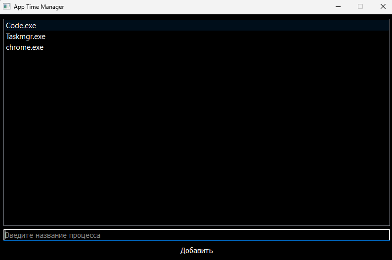
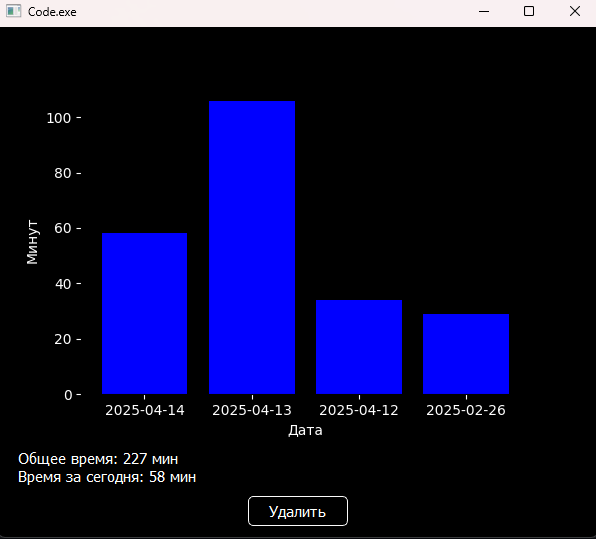

# App-Time-Manager


# App Time Manager  

## 📌 Описание  
**App Time Manager** — это приложение для отслеживания времени работы процессов на компьютере. Оно позволяет добавлять приложения в список отслеживаемых, автоматически фиксировать их время работы и сохранять данные в базе SQLite.  

## 🚀 Функционал  
- **Отслеживание времени работы приложений**  
- **Сохранение данных в SQLite**  
- **Просмотр общей статистики по каждому процессу**  
- **Вывод информации о времени работы за текущий день**  
- **Удаление приложений из отслеживаемых**  
- **Логирование работы в файл**  

## 📦 Установка и запуск  
### 1. Установите зависимости  
Убедитесь, что у вас установлен Python (версии 3.6 и выше). Затем установите необходимые зависимости:  

```bash
pip install -r requirements.txt
```

### 2. Запустите приложение  
```bash
python main.py
```

## 📖 Использование  
1. Запустите программу.  
2. Введите название процесса (например, `chrome.exe`) в поле ввода.  
3. Нажмите кнопку **"Добавить"**, и приложение начнёт отслеживать процесс.  
4. В списке появятся добавленные процессы, нажав на них, можно увидеть детальную статистику.  
5. Чтобы удалить процесс из отслеживаемых, откройте его статистику и нажмите **"Удалить"**.  

## 🛠 Технологии  
- **Язык программирования**: Python  
- **GUI**: PyQt5  
- **База данных**: SQLite  
- **Системные вызовы**: psutil  

## 📜 Логи  
Все важные события записываются в файл `manager_logs.log`, включая ошибки и успешные операции.  

# App Time Manager  

## 📌 Description  
**App Time Manager** is an application for tracking the runtime of processes on a computer. It allows users to add applications to a tracking list, automatically record their uptime, and store data in an SQLite database.  

## 📦 Installation and Launch  
### 1. Install dependencies  
Ensure that you have Python (version 3.6 or higher) installed. Then, install the required dependencies:  

```bash
pip install -r requirements.txt
```

### 2. Run the application  
```bash
python main.py
```

## 📖 Usage  
1. Launch the program.  
2. Enter the process name (e.g., `chrome.exe`) in the input field.  
3. Click the **"Add"** button to start tracking the process.  
4. The added processes will appear in the list. Click on any process to view detailed statistics.  
5. To remove a process from tracking, open its statistics window and click **"Delete"**.    

## 🛠 Technologies  
- **Programming Language**: Python  
- **GUI Framework**: PyQt5  
- **Database**: SQLite  
- **System Calls**: psutil  

## 📜 Logs  
All important events, including errors and successful operations, are recorded in the `manager_logs.log` file.  
 